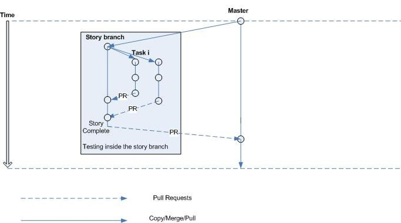

# Git Workflow

## Стратегия ветвления



### `master`-ветка

Ветка является релизной, и в неё запрещено коммититься напрямую.
На push в ветку будет добавлен pipeline для развертывания приложения на прод.

### `story`-ветки

Любая другая ветка предназначена для разработки/изменений в соответствии с задачами.
Каждая ветка соответствует **единственной** и **конкретной** фиче.

Название ветки должно соответствовать
идентификатору тикета на гитхабе или id в Jira:
`{STORY_ID}/{description}`

Пример: `#19/improve-gitflow-docs`

(Так ветка `#19/improve-gitflow-docs` закрепляется за тикетом [#19](https://github.com/trofimovama/way-to-middle/issues/19))

### Коммиты и подписи

В подписи к любому коммиту должны присутствовать идентификатор story и
краткое описание проделанной работы:

- `[{STORY_ID}] {description}`

Примеры правильной подписи:

- `[#19] improve gitflow docs`

`STORY_ID` ветки **автоматически** подставляется через `pre-commit` hook!

---

### Оформление PR

Каждый PR стоит заполнять по такому шаблону:

```markdown
Closes: {ссылка на STORY_ID}

---

##### Extra Details:

- Заполнить графу, если что-то было сделано дополнительно.
- Если ничего нет, то просто удалите cекцию `Details` целиком
```

Примеры:

```markdown
Closes: #19
```

```markdown
Closes: #19

---

##### Details:

- set up eslint;
- configured stylelint;
```

---

### Merge в `master`-ветку

На проекте используется [gh-action-bump-version](https://github.com/phips28/gh-action-bump-version), версии обновляются автоматически.

- `Merge`-коммиты льются с флагом `squash`;
- `Merge`-коммиты должны следовать схеме обычных коммитов, но с дополнительной информацией в _body_;
- `Merge`-коммиты c `breaking changes` или новой `feature` должны содержать одно из ключевых слов `major` или `minor` соответственно;

Примеры:

```markdown
[#370] fix problem with deployment (PR: #371)
```

```markdown
[#370] fix problem with deployment (PR: #371)

type: minor
```

```markdown
[#370] fix problem with deployment (PR: #371)

type: major
```
